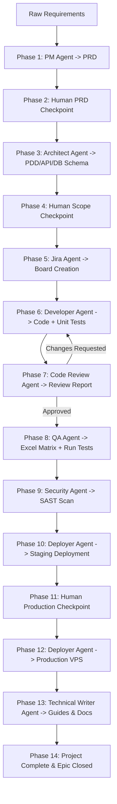

# Aikyam — Multi-Agent SDLC Pipeline & Dashboard

Aikyam is a comprehensive 14-phase multi-agent SDLC orchestration pipeline. It takes raw requirements from a user and runs them through a team of specialized AI agents (Requirements, Jira PM, Developer, Code Reviewer, QA, Security Auditor, DevOps Deployer, and Technical Writer) to generate, build, test, audit, and deploy a production-ready application to a VPS inside Docker containers, all visualizable in real-time on a premium dark-themed dashboard.

---

## Architecture Overview



---

## Tech Stack

### Backend
- **Framework:** FastAPI, Uvicorn, WebSocket for real-time updates
- **Orchestration:** Sequential state management with human-in-the-loop callback futures
- **AI Integrations:** OpenAI-compatible API client routing to Gemini, Groq, Ollama, and local vLLM endpoints (supporting the **Qwen 2.5 72B Instruct AWQ** model on DGX Spark)
- **External Integrations:** Slack Bolt API (Socket Mode), Jira Cloud API, GitHub API

### Frontend
- **Framework:** React 18, Vite, TypeScript
- **Styling:** Premium dark-themed glassmorphic UI using curated CSS variables, animated transitions, status indicators, and collapsible detail panels
- **Real-time Updates:** Native WebSocket integration matching backend broadcasts

---

## Setup Instructions

### Prerequisites
- Node.js (v20+ recommended)
- Python (v3.11+)

---

### Backend Setup

1. Navigate to the backend folder:
   ```bash
   cd backend
   ```

2. Create a virtual environment and activate it:
   ```bash
   python -m venv venv
   # On Windows:
   .\venv\Scripts\activate
   # On macOS/Linux:
   source venv/bin/activate
   ```

3. Install dependencies:
   ```bash
   pip install -r requirements.txt
   # or manually:
   pip install fastapi uvicorn[standard] python-dotenv pydantic pydantic-settings openai slack-bolt atlassian-python-api PyGithub openpyxl httpx aiofiles
   ```

4. Create and configure your environment variables:
   Copy `.env.example` to `.env` and fill in your keys:
   ```bash
   cp .env.example .env
   ```
   *Note: All agents default to `vllm` using your self-hosted DGX Spark model configuration.*

5. Run the backend server:
   ```bash
   python -m uvicorn src.main:app --host 0.0.0.0 --port 8000 --reload
   ```
   The backend API will be available at http://localhost:8000 and Swagger docs at http://localhost:8000/docs.

---

### Frontend Setup

1. Navigate to the frontend folder:
   ```bash
   cd frontend
   ```

2. Install dependencies:
   ```bash
   npm install
   ```

3. Run the development server:
   ```bash
   npm run dev
   ```
   Open the browser at http://localhost:5173/ to view the dashboard!

---

## Multi-LLM Provider Configuration

Each agent can be assigned an LLM provider dynamically in your `.env` file:
```env
REQUIREMENTS_AGENT_LLM=vllm
DEVELOPER_AGENT_LLM=vllm
CODE_REVIEW_AGENT_LLM=gemini
QA_AGENT_LLM=vllm
SECURITY_AGENT_LLM=gemini
DEPLOYMENT_AGENT_LLM=vllm
DOCUMENTATION_AGENT_LLM=vllm
```

Supported providers:
- `gemini`: Google Gemini API
- `openai`: OpenAI API
- `vllm`: Self-hosted local/remote endpoints (e.g. DGX Spark)
- `ollama`: Local llama model runner
- `groq`: Groq API (high-speed Llama 3.1)
